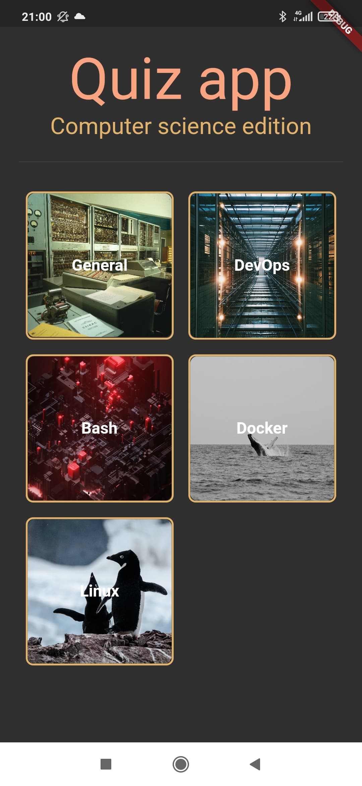
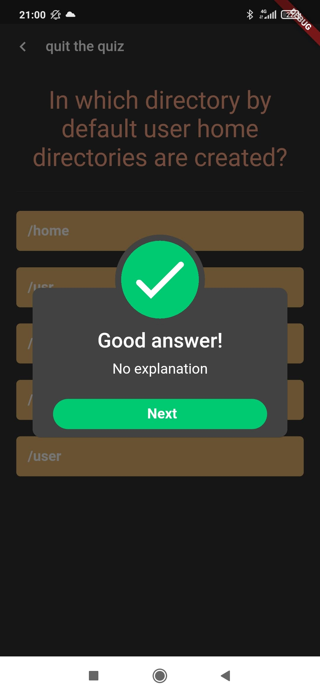

# Quiz app

A simple quiz app with computer science themes.

### Features

* Bloc pattern
* Api used for quiz : https://quizapi.io/
* 5 themes (General, DevOps Bash, docker and Linux)
* Quiz with 10 randoms questions
* Result with explanation (If available)

### Screenshots

<table>
  <thead>
    <tr>
        <th>Home page</th>
        <th>Question</th>
        <th>Answer</th>
    </tr>
  </thead>
  <tbody>
    <tr>
        <td>
            
        </td>
        <td>
            
        </td>
        <td>
            
        </td>
    </tr>
  </tbody>
</table>
